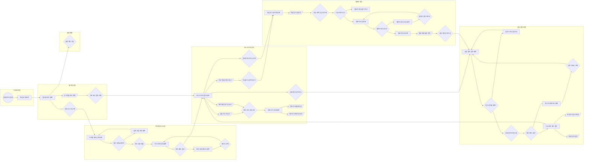

```mermaid
flowchart LR

  subgraph s1 ["인증/온보딩"]
    n1(("앱/웹 최초 실행"))
    n2["랜딩/소개 화면"]
  end

  subgraph s2 ["홈/대시보드"]
    n8["홈/대시보드 화면"]
    n9[/"내 아이템 분석 목록"/]
    n10{"새 분석 시작 선택"}
    n11{"기존 분석 결과 선택"}
  end

  subgraph s3 ["아이템 분석 요청"]
    n12["아이템 정보 입력 화면"]
    n13{"필수 입력값 충족?"}
    n14["입력 오류 안내 화면"]
    n15{"분석 요청 제출"}
    n16["분석 진행 상태 화면"]
    n17{"분석 처리 성공?"}
    n18["분석 오류/재시도 화면"]
    n19{"재시도 선택"}
  end

  subgraph s4 ["리스크 진단 결과"]
    n20["리스크 진단 결과 화면"]
    n21[/"종합 리스크 점수"/]
    n22[/"레이어별 점수 및 요인"/]
    n23[/"수요 미검증 정도 표시"/]
    n24{"진단 근거 상세 보기"}
    n25{"미검증 가설 목록 보기"}
    n26{"질문지 생성 진입 선택"}
    n27{"검증 결과 입력 진입"}
    n28["진단 근거 상세 화면"]
    n29[/"진단 근거/출처/시점"/]
    n30[/"데이터 부족/주의 항목"/]
  end

  subgraph s5 ["질문지 생성"]
    n31["미검증 가설 목록 화면"]
    n32[/"미검증 가설 항목"/]
    n33{"가설 선택 및 유형 선택"}
    n34{"가설 선택 가능?"}
    n35["질문지 생성 불가 안내"]
    n36["질문지 생성 화면"]
    n37{"질문지 생성 성공?"}
    n38["질문지 생성 오류 화면"]
    n39{"질문지 생성 재시도"}
    n40["질문지 결과 화면"]
    n41[/"질문 문항/검증 목적"/]
    n42{"검증 결과 입력 진입"}
  end

  subgraph s6 ["검증 결과 반영"]
    n43["검증 결과 입력 화면"]
    n44{"필수 결과값 충족?"}
    n45["결과 누락 오류 안내"]
    n46{"검증 결과 저장 요청"}
    n47{"갱신 처리 성공?"}
    n48["갱신 오류/재시도 화면"]
    n49{"갱신 재시도 선택"}
    n50["수요 진단 갱신 결과"]
    n51[/"반영 전후 점수 변화"/]
    n52[/"영향 입력 설명"/]
  end

  subgraph s7 ["설정/계정"]
    n54{"설정 메뉴 진입"}
  end

  n1 --> n2
  n8 --> n9
  n9 --> n11
  n8 --> n10
  n10 --> n12
  n11 --> n20
  n12 --> n13
  n13 --> n15
  n13 --> n14
  n14 --> n12
  n15 --> n16
  n16 --> n17
  n17 --> n20
  n17 --> n18
  n18 --> n19
  n19 --> n16
  n20 --> n21
  n20 --> n22
  n20 --> n23
  n21 --> n24
  n22 --> n24
  n23 --> n25
  n24 --> n28
  n25 --> n31
  n20 --> n26
  n26 --> n31
  n20 --> n27
  n27 --> n43
  n28 --> n29
  n28 --> n30
  n31 --> n32
  n32 --> n33
  n33 --> n34
  n34 --> n36
  n34 --> n35
  n36 --> n37
  n37 --> n40
  n37 --> n38
  n38 --> n39
  n39 --> n36
  n40 --> n41
  n41 --> n42
  n42 --> n43
  n43 --> n44
  n44 --> n46
  n44 --> n45
  n45 --> n43
  n46 --> n47
  n47 --> n50
  n47 --> n48
  n48 --> n49
  n49 --> n43
  n50 --> n51
  n50 --> n52
  n50 --> n20
  n8 --> n54
  n2 --> n8
```
